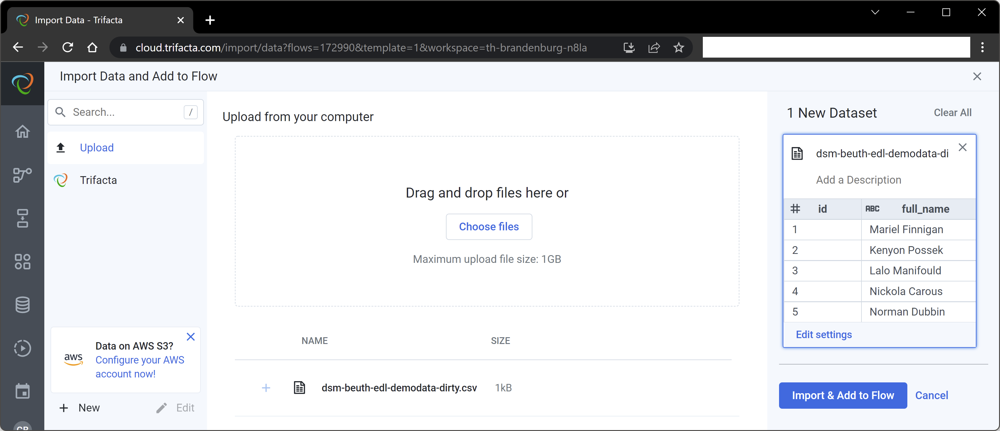

# Tool-Supported-Data-Cleaning

## Aufgabe 1
  

### Daten Hochladen
 
Ich habe die Daten als CSV-Datei gespeichert und auf trifacta hochgeladen (siehe Screenshot)
  

1- Zuerst werden alle Zeilen gelöscht, die kein gültes Alter haben.  
2- Alle Zeilen ohne ID werden gelöscht. Sie könnten später manuell hinzugefügt worden sein.  
3- Alle Zeilen werden gelöscht, die keinen "full_name" haben.  
4- Alle Zeilen werden gelöscht, die keine E-Mail Adresse haben.  
5- Alle Zeilen werden gelöscht, die kein Gender haben.  
6- Um später Duplikate zu identifizieren, werden die "id" gelöscht.  
7- Duplikate werden gelöscht.   

### Ergebnis
 
Am Ende wurde das Ergebnis in der Datei "dsm-beuth-edl-demodata-clean.csv" gespeichert.
  

  
## Aufgabe 2

 
Wenn man die Daten hochgeladen hat, ist es möglich zu sehen, wo trifacta mögliche Fehler gefunden hat. Hier gibt es 3 Zeilen mit Missmatch und 2 Zeilen, mit fehleden Daten (siehe Screenshot).
  

  

Auf dem folgenden Screenshot kann man sehen, dass es Zellen gibt, die kein Datum haben.

  

  

Auf dem folgenden Screenshot sind weitere Beispiele von Fehlern zu sehen
  

  

Die Anzahl der Zeilen mit Fehlern ist sehr klein im Vergleich zu der Anzahl der Zeilen ohne Fehler, deshalb würde ich alle Zeilen löschen, wo es Fehler gibt.
  

